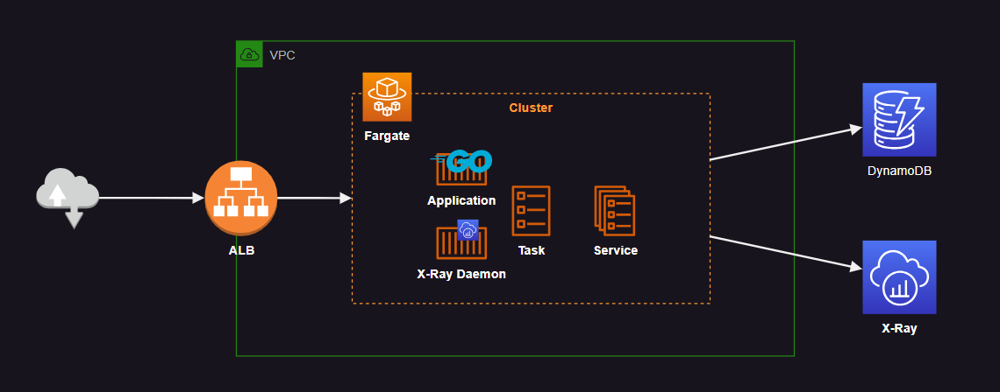

# AWS X-Ray Instrumentation

ECS Fargate cluster with X-Ray Golang application instrumentation.



Create the infrastructure:

```
terraform -chdir=aws init
terraform -chdir=aws apply -auto-approve
```

A [sampling rule][1] will be created and detect incoming requests for `/api/*`. The X-Ray SDK automatically uses this sampling rule based on the scope settings.

## Golang

Once the cluster is created, build and push the Golang application image to ECR:

```sh
bash ./app-golang/ecr.sh
```

## Node.js

Deploying the Node.js version of the application:

```sh
bash ./app-nodejs/ecr.sh
```

Reference to init a new TypeScript project with `yarn` in case it helps setting up the environment:

```sh
corepack enable
yarn init -2
yarn add typescript --dev
yarn tsc --init
```

Running locally:

```sh
nvm use 18
yarn install
yarn dev
```

[1]: https://docs.aws.amazon.com/xray/latest/devguide/xray-sdk-go-configuration.html#xray-sdk-go-configuration-sampling
